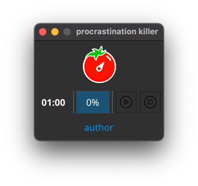

# Procrastination killer
[](https://goreportcard.com/report/github.com/SkYler163/procrastination-killer)
[](https://travis-ci.com/SkYler163/procrastination-killer)
[](LICENSE)

A little app that helps you to be more productive



## Summary
Application based on pomodoro timer method. It uses [fyne](https://github.com/fyne-io/fyne) ui toolkit and 
[beep](https://github.com/faiface/beep) package to bring sounds

## Installing

### Go
```shell
go get -u github.com/SkYler163/procrastination-killer
procrastination-killer
```

### Mac/Linux/Windows
```shell
git clone github.com/SkYler163/procrastination-killer
cd procrastination-killer
make build
bin/procrastination-killer
```

## TODO
* Add the ability to customize application
* Add the ability to block sites during work period in order to kill procrastination more efficient
* Add the ability to block apps